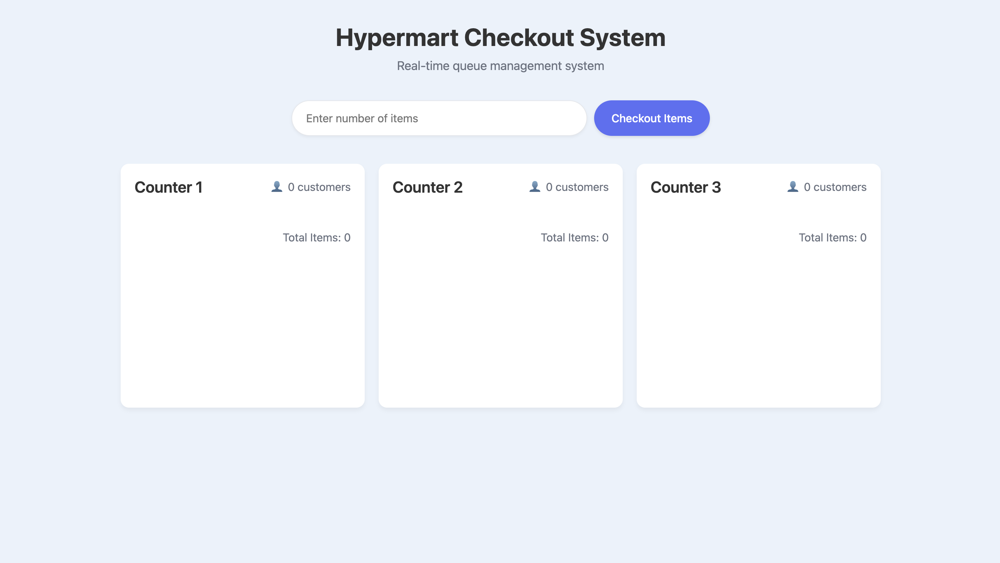

# Hypermart Checkout System

A real-time queue management system for efficiently assigning customers to checkout counters in a hypermarket.

## Demo

The application can be accessed running the HTML file locally.



## Problem Statement

The Hypermart Checkout System solves the problem of efficiently distributing customers across multiple checkout counters to minimize wait times:

- Each checkout counter starts with an empty queue (total items = 0).
- When a new customer arrives, they must be assigned to the checkout counter with the least total number of items in the queue.
- If two or more checkout counters have the same total, the customer is assigned to the leftmost counter (the one with the smallest index).

## Solution Overview

The solution implements a greedy algorithm that always assigns a new customer to the optimal checkout counter based on the current state of all queues. The implementation includes:

1. A data structure to track the state of each checkout counter
2. An algorithm to find the optimal counter for a new customer
3. A real-time UI that updates as customers are assigned or removed


### Time Complexity Analysis

- **Finding the Optimal Counter**: O(n) time complexity, where n is the number of checkout counters
  - The algorithm performs two linear passes through the counters array
  - First pass to find the minimum total items: O(n)
  - Second pass to find the leftmost counter with minimum total: O(n)
  - Total: O(n + n) = O(n)

- **Adding a Customer**: O(1) time complexity
  - Adding an item to the counter's items array: O(1)
  - Updating customer count and total: O(1)
  - Adding the new item to the DOM: O(1)

- **Removing a Customer**: O(1) time complexity
  - Removing an item from the DOM: O(1)
  - Updating customer count and total: O(1)

- **Overall Time Complexity**: O(n) where n is the number of checkout counters
  - Since the number of checkout counters is typically small and fixed (3 in this implementation), this can be considered effectively constant time O(1) in practice

### Space Complexity

- **Data Storage**: O(m) space complexity, where m is the total number of customers across all counters
  - Each customer requires O(1) space to store their item count
  - Total space needed is proportional to the total number of customers

## Features

1. **Real-time Queue Management**
   - Assign customers to optimal checkout counters
   - Update queue information in real-time
   - Remove customers when they're done

2. **Interactive UI**
   - Visual representation of checkout counters
   - Highlighted indication of the most recently assigned counter
   - Dynamic counter statistics (total items, customer count)


## Project Structure

```
hypermart-checkout/
│
├── index.html        # Main HTML structure
├── styles.css        # CSS styling for the application
├── script.js         # Core checkout algorithm and UI interactions
└── README.md         # This documentation file
```

## Assumptions Made

1. **Counter Assignment Logic**
   - The primary criterion for assignment is the least total number of items
   - The tie-breaker is the smallest counter index (leftmost counter)
   - No consideration of other factors like checkout speed or item processing time

2. **Customer Behavior**
   - Customers do not switch between checkout counters once assigned
   - Customers are processed in FIFO (First In, First Out) order within each counter
   - Each customer has a fixed number of items that doesn't change after assignment

3. **UI Assumptions**
   - The application is meant for demonstration purposes rather than production use
   - Mobile responsiveness is included but not fully optimized for all devices
   - No persistent storage - the state is reset when the page reloads

4. **Performance Considerations**
   - The system is designed for a small number of checkout counters (3-5)
   - The algorithm would remain efficient with more counters, but the UI may need adjustments

## How to Use

1. **Manual Testing**
   - Enter the number of items in the input field
   - Click "Checkout Items" button
   - Watch as the customer is assigned to the optimal counter

## Future Improvements

1. **Enhanced Analytics**
   - Track average waiting time
   - Generate reports on checkout efficiency

2. **Additional Features**
   - Checkout speed simulation based on items
   - Customer priority levels
   - Visual queue representation

3. **Advanced Algorithms**
   - Machine learning-based assignment considering historical data
   - Predictive queue management
